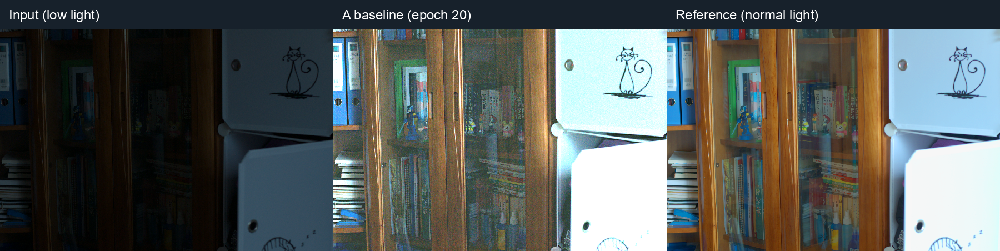
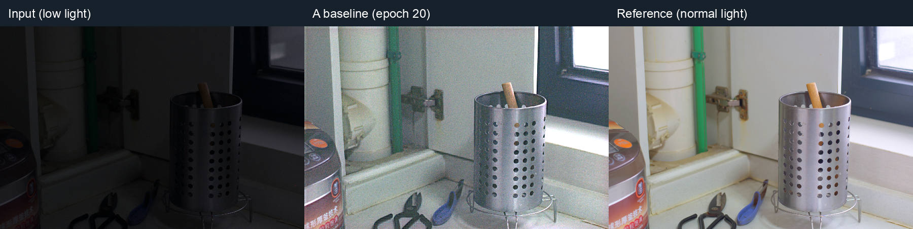

# UltraFast-LiNET 저조도 이미지 보정

어두운 사진을 밝게 보정하면서, 사진에 있는 잡음도 줄이는 방법을 실험하는 온디바이스 AI 수업 프로젝트입니다. 작은 모델인 **UltraFast-LiNET-Max**를 사용하고, 같은 모델에 어떤 데이터로 학습시키느냐에 따라 결과가 달라지는지 비교합니다.

## 보정 예시

왼쪽부터 **어두운 입력 → A 모델 보정 결과 → 밝은 정답 사진**입니다. 검증으로 선택한 A 모델(epoch 20)을 사용했으며, 별도의 잡음은 추가하지 않았습니다.





[LOL-v1](https://daooshee.github.io/BMVC2018website/) 테스트 목록의 첫 두 장(`1.png`, `111.png`)입니다. 예시는 밝기 회복을 보여주며, 잡음 제거 효과는 후속 B/C 실험에서 확인할 예정입니다.

## 지금까지 한 작업

- 공식 공개 모델을 CPU에서 실행하고, 공식 코드와 출력이 같은지 확인했습니다.
- LOL-v1 데이터셋을 **학습 435쌍 / 검증 50쌍 / 테스트 15쌍**으로 나눴습니다. 한 쌍은 어두운 사진과 정답인 밝은 사진입니다.
- 비교 기준이 되는 **A 모델을 처음부터 360 epoch 학습**하고, 테스트 평가까지 마쳤습니다. 1 epoch는 학습 데이터를 한 번 모두 사용하는 과정입니다.

검증 데이터에서 가장 좋은 결과를 낸 **20 epoch 시점의 모델**로 테스트했습니다. 테스트 데이터는 모델을 고르는 데 사용하지 않았습니다.

<details>
<summary>학습·평가 결과 보기</summary>

PSNR·SSIM은 보정 결과가 정답 이미지와 얼마나 비슷한지 나타내는 점수이며, 높을수록 좋습니다. 아래는 추가 합성 잡음 없이 평가한 결과입니다.

<!-- FINAL_RESULTS_START -->

| 항목 | 결과 |
|---|---|
| 완료 epoch / 목표 epoch | **360 / 360** |
| 검증으로 선택한 epoch | **20** |
| 선택 시 검증 50쌍 평균 PSNR / SSIM | **16.0612 dB / 0.515624** |
| 공식 시험 15쌍 평균 PSNR / SSIM, 추가 합성 잡음 없음 | **17.9173 dB / 0.527209** |
| 선택된 checkpoint SHA-256 | `1e2df6a4e420bf8335790cd14c8102ca58f9d804126c7a31f3275f648d445fe6` |
| 로그에 기록된 학습·검증 시간 합 | 2.242시간; 절전·대기 포함 가능 |

<!-- FINAL_RESULTS_END -->

</details>

**현재 완료된 것은 A 모델입니다. 잡음을 추가해 학습하는 B/C 실험과 그 효과 비교는 아직 진행하지 않았습니다.** 논문과 데이터 분할 등 조건이 달라 논문 점수와 바로 비교하기는 어렵습니다.

## 앞으로 비교할 실험

모델 구조는 그대로 두고, 학습에 사용하는 사진만 바꿉니다.

| 모델 | 학습 방법 | 상태 |
|---|---|---|
| A | 원본 저조도 사진으로 학습 | 완료 |
| B | 원본 사진 절반 + 일정한 세기의 잡음을 추가한 사진 절반 | 예정 |
| C | 원본 사진 절반 + 여러 세기의 잡음을 추가한 사진 절반 | 예정 |

다음 단계는 B/C를 구현하고, 같은 테스트 사진에서 **보정 품질과 CPU 실행시간**을 비교하는 것입니다. 데이터 분할과 학습 조건을 맞추고, 실험 설정은 검증 데이터로 결정합니다. 구체적인 잡음 세기와 비교 규칙은 [실험 상세 안내](docs/EXPERIMENT_GUIDE.md)에 있습니다.

## 팀원이 먼저 보면 좋은 파일

| 궁금한 내용 | 파일 |
|---|---|
| A 모델의 최종 결과 | [최종 보고서](reports/FINAL_RESULTS.md) |
| 직접 실행하는 방법 | [실행 가이드](docs/EXPERIMENT_GUIDE.md#설치) |
| 학습 설정과 코드 | [baseline_a.json](configs/baseline_a.json) · [train_a.py](scripts/train_a.py) |
| 평가 코드와 이미지별 결과 | [evaluate.py](scripts/evaluate.py) · [per_image.csv](reports/a_final_seed42/per_image.csv) |

## 실행 시작하기

Python 3.12 기준이며, CPU로 실행할 수 있습니다. 확인한 환경은 macOS / Apple M2 Pro입니다.

```bash
git clone https://github.com/7b7hom/ultrafast-linet-baseline.git
cd ultrafast-linet-baseline
python3.12 -m venv .venv
.venv/bin/python -m pip install -r requirements.lock.txt
```

실행용 전체 데이터셋은 별도로 내려받아야 합니다. 이후 **데이터 준비 → 이미지 보정 실행 → 학습·평가** 순서는 [실행 가이드](docs/EXPERIMENT_GUIDE.md#실행-방법)를 따라가면 됩니다.

## 참고

[공식 코드](https://github.com/YuhanChen2024/UltraFast-LiNET)를 바탕으로 만든 수업 프로젝트입니다. 논문과 공개 코드의 차이, 세부 설정과 재현 기록은 [실험 상세 안내](docs/EXPERIMENT_GUIDE.md)에 모았습니다.

[논문](https://arxiv.org/abs/2512.02965) · [LOL 데이터셋](https://daooshee.github.io/BMVC2018website/) · [Apache-2.0 라이선스](LICENSE)
